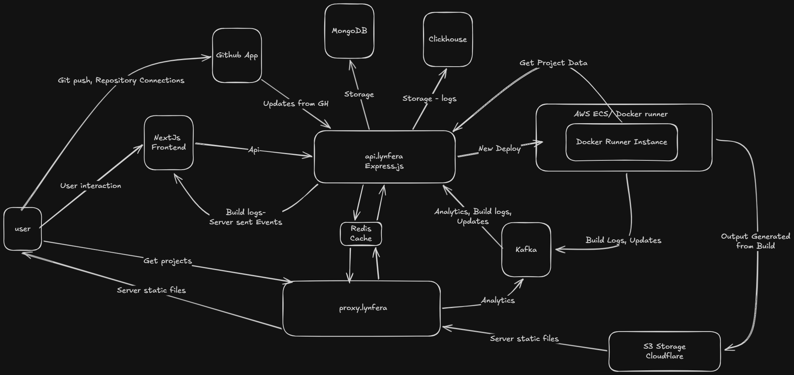

# Deployment-site

<div align="center" style="display:flex;
align-items: center; 
justify-content: center; gap: 20px">
	<h3 style="display:inline;">Lynfera</h3>
  
</div>

A platform to host, build, and deploy frontend applications, similar to a lightweight self-hosted Vercel/Netlify workflow.

This repository contains multiple coordinated services that handle builds, routing, storage, UI, and deployment automations.

---

## 🔧 Folder Diagram

```
Deployment-site
│
├───api-server/
│
├───build-server/
│
├───frontend-server/
│
├───reverse-proxy-server/
│
├───test-server/
│
├───README.md
└───.gitignore
```

-   **[api-server](./api-server)**
-   **[build-server](./build-server)**
-   **[frontend-server](./frontend)**
-   **[reverse-proxy-server](./reverse-proxy-server)**
-   **[test-server](./test-server)**

---

<br/>
<br/>

## 🧩 Service Roles

| Directory              | Description                          |
| ---------------------- | ------------------------------------ |
| `api-server`           | API endpoints, logs and analytics.   |
| `frontend`             | Nextjs frontend.                     |
| `reverse-proxy-server` | Express-based reverse proxy pointer. |
| `build-server`         | Docker container files.              |
| `test-server`          | Testing api, Mocks s3 for local.     |

---

## 🛠 How to Run

```sh
git clone https://github.com/AmalJose664/Deployment-site.git
cd Deployment-site
```

<br>
<br><br><br><br>
## 🛠 Understanding


